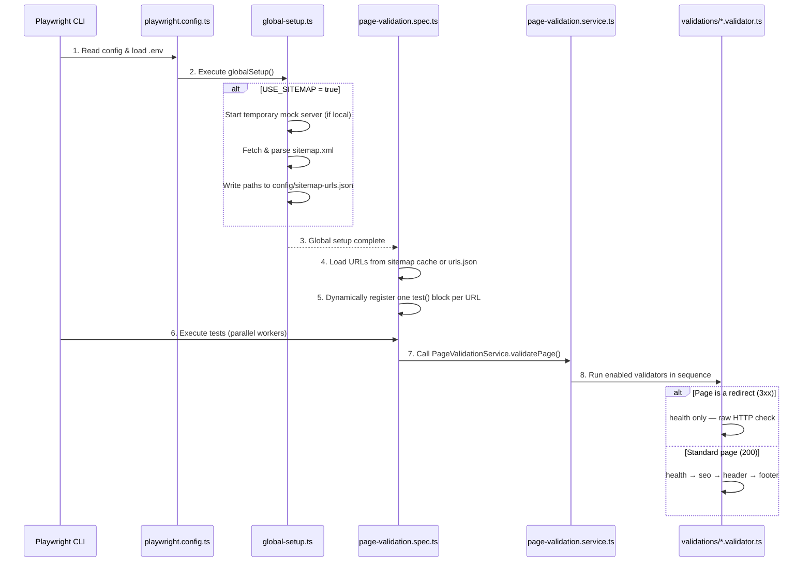

# Functionality Guide

This document covers usage scenarios, the execution flow, and how to extend the validation framework with new checks.

---

## 📋 Usage Scenarios

### Scenario A: Local Development & Framework Verification

Use this when developing the framework locally to verify checks work without hitting a real server.

1. Configure `.env` for local mock server:
   ```ini
   BASE_URL=http://localhost:3001
   USE_SITEMAP=true
   ```
2. Run tests:
   ```bash
   npx playwright test
   ```
   Playwright automatically starts `tests/mock-server.js`, parses the mock sitemap, and runs all E2E assertions locally.

---

### Scenario B: Testing a Curated List of Pages (Manual Mode)

Use this to validate a specific set of pages on staging or production.

1. List the relative page paths in `config/urls.json`:
   ```json
   [
     "/",
     "/about",
     "/redirect-source"
   ]
   ```
2. Configure `.env`:
   ```ini
   BASE_URL=https://odyssey.stage.edx.org/
   USE_SITEMAP=false
   ```
3. Run tests:
   ```bash
   npx playwright test
   ```

---

### Scenario C: Full Site Crawl via Sitemap (Sitemap Mode)

Use this to discover and validate all pages published in a site's XML sitemap.

1. Configure `.env`:
   ```ini
   BASE_URL=https://odyssey.stage.edx.org/
   USE_SITEMAP=true
   SITEMAP_PATH=/sitemap.xml
   ```
2. Run tests:
   ```bash
   npx playwright test
   ```
   `global-setup.ts` fetches the sitemap before tests start, extracts all URL paths, and registers independent parallel test cases for each page.

---

## 🚀 Code Execution Flow

The test execution follows a synchronous setup phase followed by asynchronous parallel test execution:



---

## 🛠️ How to Extend the Framework

Adding a new validator follows a consistent three-step pattern.

### Example: Adding a "Performance" Validator

#### Step 1 — Add Configuration Types

Add an interface and default values to [`config/page-validation.config.ts`](../config/page-validation.config.ts):

```typescript
export interface PerformanceValidationConfig {
  required: boolean;
  maxLoadTimeMs: number;
}

export interface PageValidationConfig {
  // ... existing fields
  performanceDefaults: PerformanceValidationConfig;
}

// In defaultConfig:
performanceDefaults: {
  required: true,
  maxLoadTimeMs: 3000,
}
```

#### Step 2 — Create the Validator File

Create `validations/performance.validator.ts`:

```typescript
import { Page, expect } from "@playwright/test";
import { PerformanceValidationConfig } from "../config/page-validation.config";

export async function validatePerformance(
  page: Page,
  config: PerformanceValidationConfig
): Promise<void> {
  const loadTime = await page.evaluate(() => {
    const timing = window.performance.timing;
    return timing.loadEventEnd - timing.navigationStart;
  });

  if (loadTime > 0) {
    expect(
      loadTime,
      `Page load time exceeded limit of ${config.maxLoadTimeMs}ms`
    ).toBeLessThan(config.maxLoadTimeMs);
  }
}
```

#### Step 3 — Register in the Service

Import and register the validator in [`services/page-validation.service.ts`](../services/page-validation.service.ts):

```typescript
import { validatePerformance } from "../validations/performance.validator";

// Add to ValidatorType union:
export type ValidatorType = "health" | "seo" | "header" | "footer" | "performance";

// Add to VALIDATOR_REGISTRY:
performance: {
  type: "performance",
  name: "Performance",
  validate: async (page, requestContext, pageConfig, baseURL, service) => {
    const perfConfig = {
      ...service.config.performanceDefaults,
      ...pageConfig.performance,
    };
    if (perfConfig.required) {
      await validatePerformance(page, perfConfig);
    }
  },
},
```

Then enable it in `.env`:

```ini
ACTIVE_VALIDATORS=health,seo,header,footer,performance
```
